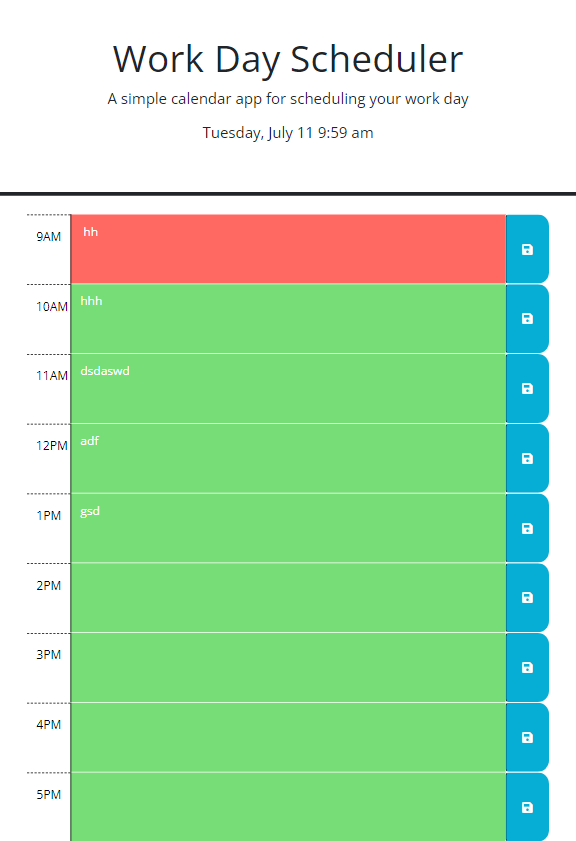

# Work-Day-Scheduler-
Challenge 05

## Description
This assignment was created to showcase the skills of May Pham to incorporate HTML, JQuery, and CSS to create a daily planner that displays the current date, saves information to local storage, and color coordinates the time based on current, future, and past hours. Some methods of JQuery demonstrated in this activity include dayjs, local files, this, if else statements, etc. 

## Usage

https://github.com/mayphamx/Work-Day-Scheduler-

https://mayphamx.github.io/Work-Day-Scheduler-/ 